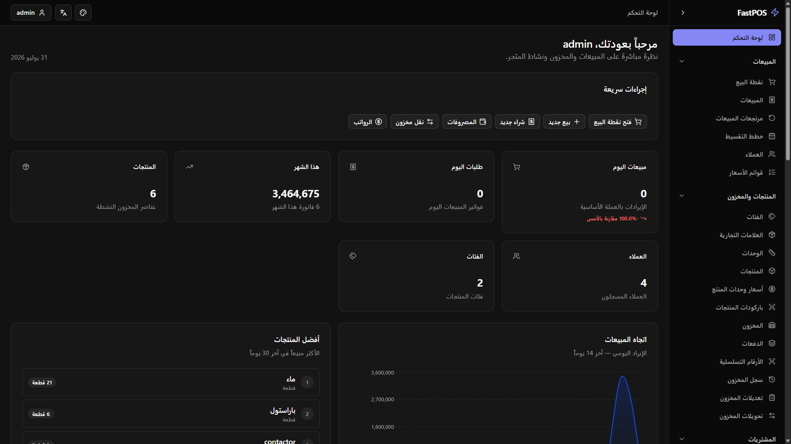
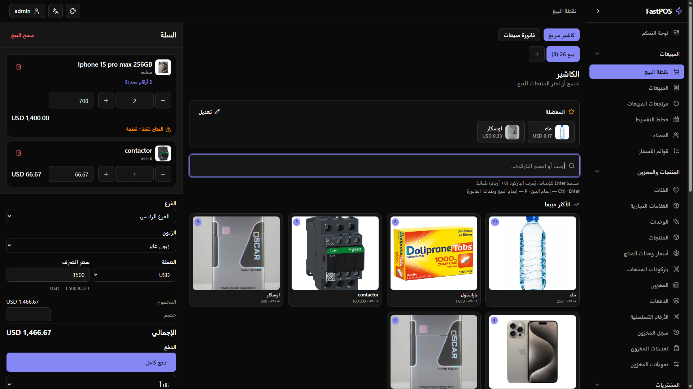
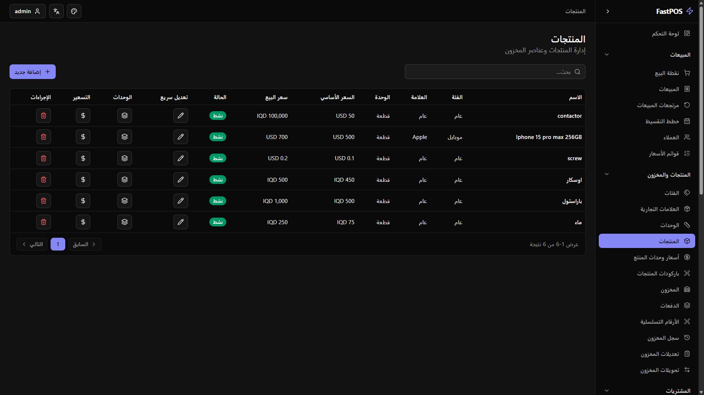
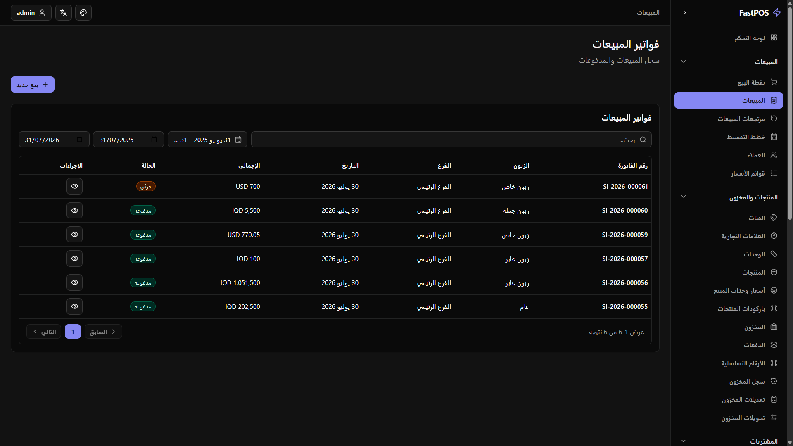
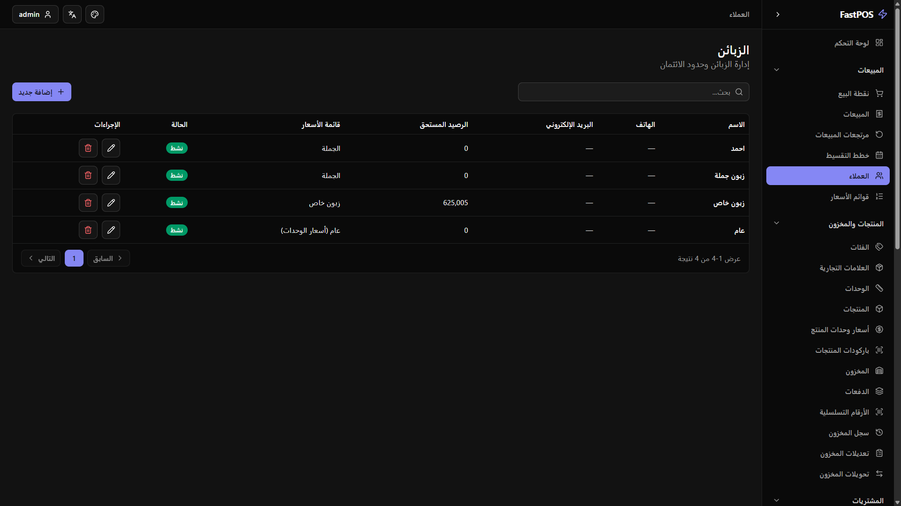

# FastPOS

A modern Point of Sale (POS) and business management system designed for retail businesses.

FastPOS provides tools for managing sales, purchases, inventory, customers, suppliers, expenses, installments, and multiple branches through a multilingual interface.

## Screenshots

### Dashboard



### POS / Cashier



### Products & Inventory



### Sales



### Customers



### Reports


## Features

* Point of Sale and cashier management
* Multiple carts
* Barcode-based product search
* Walk-in and registered customers
* Customer debt and installment sales
* Supplier management and supplier ledger
* Inventory management
* Multiple units and multiple barcodes
* Different price levels such as normal, wholesale, and VIP
* Batch and expiry tracking
* Serial number tracking
* Multi-branch support
* Branch-scoped user roles and permissions
* Daily expenses
* Cash management
* End-of-day closing
* Purchase and purchase return management
* Sales return management
* Profit and sales reporting
* IQD and USD support
* Arabic, Kurdish, and English interfaces
* Online and offline-oriented business workflows
* Thermal and PDF invoice support

## Technology Stack

### Backend

* ASP.NET Core Web API
* Entity Framework Core
* PostgreSQL
* JWT Authentication

### Frontend

* React
* Vite
* TypeScript / JavaScript
* shadcn/ui

## Architecture

The application follows a separation between the frontend, API, business logic, and data-access concerns.

```text
React Frontend
      │
      ▼
ASP.NET Core Web API
      │
      ▼
Business / Application Logic
      │
      ▼
Entity Framework Core
      │
      ▼
PostgreSQL
```

## Target Businesses

FastPOS can be adapted for businesses such as:

* Supermarkets
* Pharmacies
* Clothing stores
* Phone shops
* Tire shops
* Solar equipment businesses
* Wholesale businesses
* Other retail businesses

## Project Status

Actively developed as a portfolio and real-world business management project.

## Author

Ealam Dhahir Taher

GitHub: https://github.com/EaloTaher
LinkedIn: https://www.linkedin.com/in/ealam-taher
Email: ealamtaher4@gmail.com
